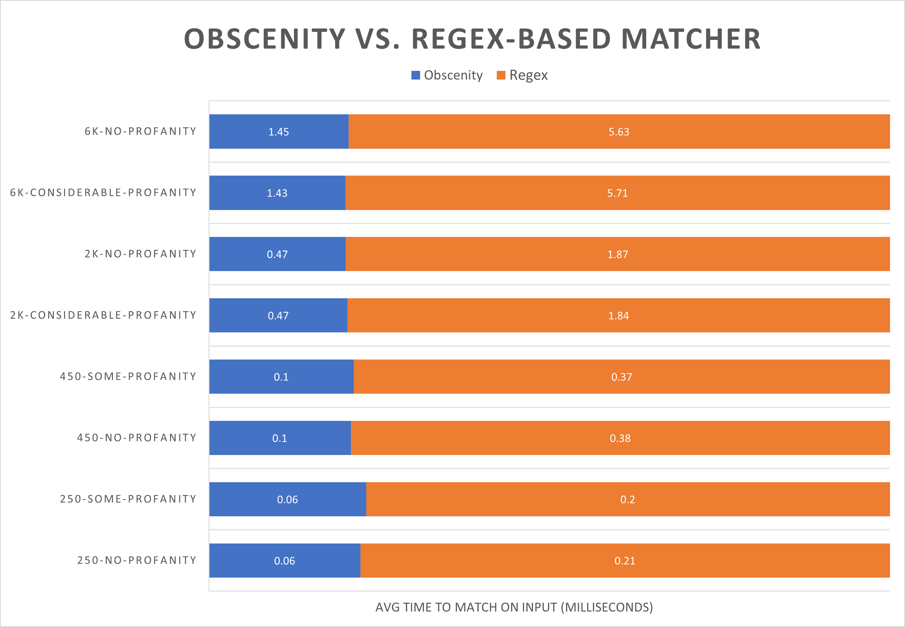

# Obscenity

TODO: Badges.

[obscenity](https://www.lexico.com/definition/obscenity) **əbˈsɛnɪti** _noun_

1.2. An extremely offensive word or expression.

# Table of Contents

- [About](#about)
- [Installation](#installation)
- [Example Usage](#example-usage)
- [Additional Examples](#additional-examples)
- [Writing your own patterns](#writing-your-own-patterns)
- [Documentation](#documentation)
- [Performance](#performance)
- [Contributing](#contributing)
- [Author](#author)

## About

Obscenity is a high-performance, robust **profanity filter** for NodeJS (with support for **TypeScript** as well). It is:

- **Accurate:** To handle the famed [scunthorpe problem](https://en.wikipedia.org/wiki/Scunthorpe_problem), Obscenity supports word boundary assertions (so a pattern `|cunt` would only match `cunt`, `cunts`, ... but not `scunt`) in addition to whitelisting phrases.

  > As with all swear filters, Obscenity is not perfect (nor will it ever be). Use its output as a heuristic, and not as the sole judge of whether some content is appropriate or not.

- **Robust:** To counter common bypasses, Obscenity features _transformers_, which normalize the text before matching. Consequently, it can catch many obscene phrases that other libraries cannot.

  See the [example code](#example-usage) for some examples of what Obscenity can match.

- **Fast:** Obscenity's pattern matcher doesn't use regular expressions. Instead, it uses finite automata, making it very fast. [Benchmarks](#performance) show that, with the English preset (~100 patterns), it is consistently **3x faster** than an equivalent approach with string methods and regular expressions.

- **Powerful:** Though Obscenity doesn't support regular expressions (as mentioned above), its pattern syntax does support arbitrary-length wildcards and optionals. Furthermore, thanks to transformers, a single pattern is often enough to match a lot of variations. With the default English preset, `fuck` matches all of the following:

  - `f u u u u ck`;
  - `f....uu....ck`;
  - `inthemiddleofuckasentence`;
  - `ʃᵤс𝗄`.

- **Well tested:** Obscenity has an extensive test suite with 100% branch coverage in addition to fuzz tests using [fast-check](https://github.com/dubzzz/fast-check) for the pattern matcher.

## Installation

```sh-session
npm install obscenity
yarn add obscenity
pnpm add obscenity
```

## Example Usage

```javascript
const {
	PatternMatcher,
	englishDataset,
	englishRecommendedBlacklistMatcherTransformers,
	englishRecommendedWhitelistMatcherTransformers,
} = require('obscenity');

// Creating a matcher is somewhat expensive, so do this only once in your app if possible:
const matcher = new PatternMatcher({
	...englishDataset.build(),
	blacklistMatcherTransformers: englishRecommendedBlacklistMatcherTransformers,
	whitelistMatcherTransformers: englishRecommendedWhitelistMatcherTransformers,
});

const input = 'ʃʃᵤс𝗄 you';
console.log(
	matcher.setInput(input).hasMatch() ? 'The input contains obscenities.' : 'The input does not contain obscenities.',
);
```

In ESM and TypeScript, use the following to import:

```typescript
import { PatternMatcher, ... } from 'obscenity';
// Or:
import * as obscenity from 'obscenity';
```

The above example matches on **all of the following**:

- you are a little **fuck**er
- **fk** you
- **fffuk** you
- i like **a$$es**
- aaa**ʃuck**you
- **f....uuuuu.......ck**

...and it **does not match** on the following:

- the **pen is** mightier than the sword
- i love banan**as s**o yeah
- this song seems really b**anal**
- g**rape**s are really yummy

## Additional Examples

### Censoring profane phrases

If you want to re-send the input with profanities changed to a less offensive phrase, you can do it with the help of Obscenity's `TextCensor` class.

The default censoring strategy used by the `TextCensor` is grawlix, but there are several other commonly used censoring strategies available. See the documentation for the [TextCensor](./docs/reference/classes/TextCensor.md) class for more details.

<details>
	<summary>Click to show code</summary>

```javascript
const {
	TextCensor,
	PatternMatcher,
	englishDataset,
	englishRecommendedBlacklistMatcherTransformers,
	englishRecommendedWhitelistMatcherTransformers,
} = require('obscenity');

const matcher = new PatternMatcher({
	...englishDataset.build(),
	blacklistMatcherTransformers: englishRecommendedBlacklistMatcherTransformers,
	whitelistMatcherTransformers: englishRecommendedWhitelistMatcherTransformers,
});
const censor = new TextCensor();

const input = 'you are a fucking retard';
const matches = matcher.setInput(input).getAllMatches();
console.log(censor.applyTo(input, matches)); // you are a $$$*ing %&*%**
```

</details>

### Removing words from presets

If you want to use the English dataset but don't agree with some of the word choices, that's easy to fix! Just remove the word in question.

<details>
	<summary>Click to show code</summary>

```javascript
const {
	PatternMatcher,
	englishDataSet,
	englishRecommendedBlacklistMatcherTransformers,
	englishRecommendedWhitelistMatcherTransformers,
	DataSet,
} = require('obscenity');

// Create a custom dataset.
const myDataset = new DataSet()
	.addAll(englishDataset)
	.removePhrasesIf((phrase) => phrase.metadata.displayName === 'whore'); // remove 'whore'
const matcher = new PatternMatcher({
	...myDataset.build(),
	blacklistMatcherTransformers: englishRecommendedBlacklistMatcherTransformers,
	whitelistMatcherTransformers: englishRecommendedWhitelistMatcherTransformers,
});
// ...
```

</details>

## Writing your own patterns

To write your own patterns, see the documentation for the [pattern template tag](./docs/reference/README.md#pattern). A quick summary is:

- `?` matches any character: `a?` matches `ab`, `ac`, `ad`, `a-`, and so on.
- `|` at the start or end asserts position at a word boundary: `|cunt` matches `cunt`, `cunts`, ..., but not `scunt`.
- `[x]` makes `x` optional: `[s]up` matches both `sup` and `up`.

With this, we can begin writing some patterns. Let's say we want to match `hoe`. A pattern that comes to mind would just be `hoe` literally. However, that would match `shoe`, `phoenix`, `orthoepists`, and quite a few more. If we add a word boundary assertion to the start, though, the number of false positives decreases significantly: `|hoe`.

To actually use our new pattern, we need to register it with the `PatternMatcher`:

```javascript
const matcher = new PatternMatcher({
	blacklistedPatterns: [{ id: 0, pattern: pattern`|hoe` }],
});
```

As you can see, in the above example, we had to assign an ID to the pattern. This might not be desirable if you don't really need to know which pattern matched (just that one did).
In that case, you can use the `assignIncrementingIds` utility, which does what its name says.

```javascript
const matcher = new PatternMatcher({
	blacklistedPatterns: assignIncrementingIds([pattern`|hoe`]),
});
```

## Documentation

- [Auto-generated API documentation](./docs/reference)
- [Article about how Obscenity works internally](TODO)

## Performance

**Summary:** With the English dataset (~100 patterns), Obscenity is ~3-4x faster than a brute-force approach with regular expressions and string methods.
Furthermore, due to how Obscenity works internally, Obscenity should, in theory, have the same performance regardless of the number of patterns, while the brute-force approach would degrade in performance as the number of patterns increases.

> **Note:** As is usual with benchmarks like these, YMMV. If you are concerned about performance, you should benchmark Obscenity yourself for your use-case.
> Also note that Obscenity uses more memory (as it builds a finite automata from the patterns) than the brute-force approach.

This benchmark was ran on Node v16.7.0 on a Windows 10 Pro, with an Intel i5-7500 CPU @ 3.4GHz and 4 cores. Lorem Ipsum strings of length 250, 450, 2,000 and 6,000 were generated; half of the strings had no profanity and others had amounts varying from a few profane phrases to dozens.



<details>
	<summary>Click to view raw benchmark output</summary>

```
🏁 Running case lorem-ipsum-250-chars-no-profanity

Results for Obscenity:
  - Min: 0.06 ms
  - Max: 3.64 ms
  - Mean: 0.06 ms
  - Standard deviation: ± 0.03 ms

Results for Regular Expressions:
  - Min: 0.20 ms
  - Max: 3.58 ms
  - Mean: 0.21 ms
  - Standard deviation: ± 0.02 ms

🏁 Running case lorem-ipsum-250-chars-some-profanity

Results for Obscenity:
  - Min: 0.05 ms
  - Max: 3.05 ms
  - Mean: 0.06 ms
  - Standard deviation: ± 0.02 ms

Results for Regular Expressions:
  - Min: 0.19 ms
  - Max: 1.69 ms
  - Mean: 0.20 ms
  - Standard deviation: ± 0.02 ms

🏁 Running case lorem-ipsum-2k-chars-considerable-profanity

Results for Obscenity:
  - Min: 0.45 ms
  - Max: 7.26 ms
  - Mean: 0.47 ms
  - Standard deviation: ± 0.05 ms

Results for Regular Expressions:
  - Min: 1.74 ms
  - Max: 56.69 ms
  - Mean: 1.84 ms
  - Standard deviation: ± 0.56 ms

🏁 Running case lorem-ipsum-2k-chars-no-profanity

Results for Obscenity:
  - Min: 0.45 ms
  - Max: 5.45 ms
  - Mean: 0.47 ms
  - Standard deviation: ± 0.04 ms

Results for Regular Expressions:
  - Min: 1.78 ms
  - Max: 25.53 ms
  - Mean: 1.87 ms
  - Standard deviation: ± 0.22 ms

🏁 Running case lorem-ipsum-450-chars-no-profanity

Results for Obscenity:
  - Min: 0.09 ms
  - Max: 8.82 ms
  - Mean: 0.10 ms
  - Standard deviation: ± 0.04 ms

Results for Regular Expressions:
  - Min: 0.35 ms
  - Max: 8.88 ms
  - Mean: 0.38 ms
  - Standard deviation: ± 0.07 ms

🏁 Running case lorem-ipsum-450-chars-some-profanity

Results for Obscenity:
  - Min: 0.09 ms
  - Max: 27.08 ms
  - Mean: 0.10 ms
  - Standard deviation: ± 0.09 ms

Results for Regular Expressions:
  - Min: 0.34 ms
  - Max: 7.50 ms
  - Mean: 0.37 ms
  - Standard deviation: ± 0.06 ms

🏁 Running case lorem-ipsum-6k-chars-considerable-profanity

Results for Obscenity:
  - Min: 1.34 ms
  - Max: 34.14 ms
  - Mean: 1.43 ms
  - Standard deviation: ± 0.21 ms

Results for Regular Expressions:
  - Min: 5.18 ms
  - Max: 58.49 ms
  - Mean: 5.71 ms
  - Standard deviation: ± 0.75 ms

🏁 Running case lorem-ipsum-6k-chars-no-profanity

Results for Obscenity:
  - Min: 1.34 ms
  - Max: 28.33 ms
  - Mean: 1.45 ms
  - Standard deviation: ± 0.27 ms

Results for Regular Expressions:
  - Min: 5.22 ms
  - Max: 67.37 ms
  - Mean: 5.63 ms
  - Standard deviation: ± 0.51 ms

(Ignore, to guard against dead code elimination) 12500000
```

</details>

See the benchmark code [here](./benchmarks/index.ts).

### Why no benchmarks against other libraries?

The feature set of this library and most other profanity filtering libraries is incompatible enough to make any real benchmark somewhat unfair to both sides.

However, as most other libraries use some form of regular expressions for matching, the benchmark above is likely applicable. Though, again, if you are worried about performance, benchmark Obscenity yourself for your use-case.

### Running the benchmarks yourself

Clone the repository, then run the following commands:

```sh-session
pnpm build
pnpm bench
```

Note that by default, to lower the standard deviation, the number of runs is quite high (`100,000`). Due to this, the benchmark may take some time to run.
To speed it up, simply change `1e5` in the code to `1e4` or `1e3`.

## Contributing

TODO.

## Author

**Obscenity** © [Joe L.](https://github.com/jo3-l/) under the MIT license. Authored and maintained by Joe L.

> GitHub [@jo3-l](https://github.com/jo3-l)
